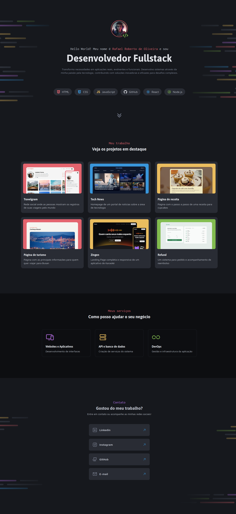

# Portfólio Dev 👨🏻‍💻

> Formação Full-Stack: Avançando no HTML e CSS: Layout com CSS (desafio prático)

O site é um portfólio digital voltado para desenvolvedores, projetado para destacar os principais projetos realizados e facilitar o acesso às informações de contato dos profissionais.

[🔗 Clique aqui para acessar o projeto](https://fel1324.github.io/PortfolioDev/)

## 🛠️ Tecnologias

- HTML
- CSS
- Git e Github

## 💚 Contato

rafael.roberto200618@gmail.com

---

Feito com ♥ by Rocketseat :wave: [Participe da nossa comunidade!](https://discord.gg/rocketseat)
